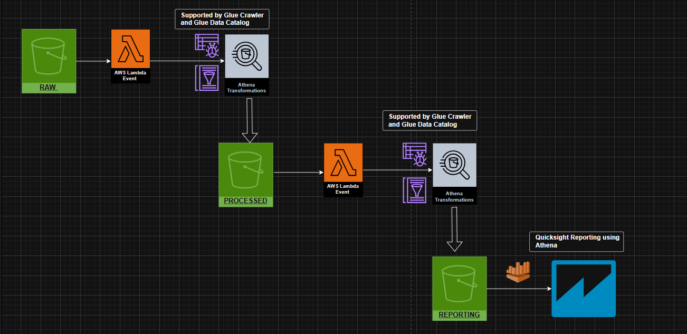

# 🏗️ AWS S3 Data Lakehouse — Stocks Analytics Pipeline

> An end-to-end serverless data lakehouse on AWS Cloud built for stock market data ingestion, transformation, and reporting using S3, Lambda, Glue and Athena

---

## 📐 Architecture Overview



The pipeline follows a **three-zone medallion architecture** — Raw → Processed → Reporting — orchestrated entirely via S3 events and AWS Lambda.

```
S3 (RAW)
  └─► Lambda Event ──► Glue Crawler + Athena Transformations
                            └─► S3 (PROCESSED)
                                  └─► Lambda Event ──► Glue Crawler + Athena Transformations
                                                            └─► S3 (REPORTING)
                                                                  └─► QuickSight (via Athena)
```

---

## 🪣 S3 Bucket Layout

The project uses a **single S3 bucket** with three logical zones as top-level folders:

```
s3://hyn-stocks-datalakehouse/
├── raw/
│   └── stocks/
│               └── *.csv
│
├── processed/
│   └── stocks/
│       └── year=YYYY/
│           └── month=MM/
│               └── *.parquet
│
└── reporting/
    ├── monthly/
    │       └── *.parquet
    └── yearly/
        └── *.parquet
```

---

## 🗄️ Athena Tables (hyn_stocks_db)

All tables are registered in the **`hyn_stocks_db`** Glue Data Catalog database.

### 1. `stocks_raw`
> Represents raw data landed in the RAW S3 zone. Crawled by Glue Crawler.
**S3 Location:** `s3://hyn-stocks-datalakehouse/raw/`

---

### 2. `stocks_processed`
> Partitioned, cleaned data in the PROCESSED zone. Enriched with year/month partition columns.
**S3 Location:** `s3://hyn-stocks-datalakehouse/processed/`

---

### 3. `monthly_stock_reporting`
> Aggregated monthly summary table used for trend analysis and dashboards.

**S3 Location:** `s3://hyn-stocks-datalakehouse/reporting/monthly/`

---

### 4. `yearly_stock_reporting`
> Aggregated yearly summary table for long-term trend visualization in Reporting.
**S3 Location:** `s3://hyn-stocks-datalakehouse/reporting/yearly/`

---

## ⚡ Lambda Functions

### Lambda 1 — RAW to PROCESSED (`lambda_raw_to_processed.py`)

**Trigger:** S3 Event Notification on `raw/` prefix (ObjectCreated)

**Responsibilities:**
- Reads raw CSV file from the RAW S3 zone.
- Parses and validates records
- Extracts `year` and `month` partition columns from the `date` field
- Writes partitioned data to the PROCESSED zone

**Flow:**
```
S3 PUT (raw/) ──► Lambda Trigger
                    ├─ Read CSV from s3://…/raw/
                    ├─ Transform + extract partitions
                    ├─ Write to s3://…/processed/year=YYYY/month=MM/
                    └─ Update Athena partition on stocks_processed
```

---

### Lambda 2 — PROCESSED to REPORTING (`lambda_processed_to_reporting.py`)

**Trigger:** S3 Event Notification on `processed/` prefix (ObjectCreated)

**Responsibilities:**
- Reads newly partitioned data from the PROCESSED zone
- Executes Athena aggregation queries to compute monthly and yearly summaries
- Writes aggregated results to the REPORTING zone
- Inserts/upserts records into `monthly_stock_reporting` and `yearly_stock_reporting`

**Flow:**
```
S3 PUT (processed/) ──► Lambda Trigger
                          ├─ Run Athena monthly aggregation query
                          ├─ Write results to s3://…/reporting/monthly/
                          ├─ Run Athena yearly aggregation query
                          ├─ Write results to s3://…/reporting/yearly/
                          └─ Repair partitions on reporting tables
```

---

## 🚀 Setup & Deployment Guide

### Prerequisites
- AWS Account with appropriate permissions
- AWS CLI configured
- Python 3.10+ (for Lambda runtime)
- S3 bucket created (e.g., `hyn-stocks-datalakehouse`)

---

### Step 1 — S3 Bucket & Folder Setup

Create your S3 bucket and ensure the following top-level prefixes exist:
```
raw/
processed/
reporting/
```
> Refer to [`S3_Folders.png`](S3_Folders.png) for the expected structure.

---

### Step 2 — IAM Role Setup

Create an IAM role for Lambda with the following managed policies:
- `AmazonS3FullAccess` (or a scoped-down custom policy for your bucket)
- `AmazonAthenaFullAccess`
- `AWSGlueServiceRole`
- `CloudWatchLogsFullAccess`

> Detailed role setup instructions: [`role_setup.md`](role_setup.md)

---

### Step 3 — Glue Crawler Setup

1. Go to **AWS Glue → Crawlers → Create Crawler**
2. Create database: `hyn_stocks_db`
3. Set up crawlers that will be run automatically in Lamdba function

> Detailed crawler setup: [`crawler_setup.md`](crawler_setup.md)

---

### Step 4 — Deploy Lambda Functions

1. Navigate to **AWS Lambda → Create Function**
2. Choose **Author from scratch**, Python 3.10 runtime
3. Attach the IAM role created in Step 2
4. Upload the relevant script from the `Lambda Scripts/` folder
5. Set **S3 trigger** on the appropriate prefix:
   - Lambda 1: trigger on `raw/` prefix
   - Lambda 2: trigger on `processed/` prefix
6. Set **timeout** to at least 5 minutes (Athena queries can be slow)
7. Set **memory** to 512 MB or higher

---

### Step 5 — Upload Dataset & Test

1. Upload CSV files from the `Dataset/` folder into `s3://…/raw/stocks/`
2. Lambda 1 will trigger → data flows to `processed/`
3. Lambda 2 will trigger → aggregated data flows to `reporting/`
4. Verify in Athena using the sample queries above

---

## 🛠️ AWS Services Used

| Service | Role |
|---|---|
| **Amazon S3** | Three-zone data lake storage (Raw / Processed / Reporting) |
| **AWS Lambda** | Serverless ETL orchestration triggered by S3 events |
| **AWS Glue Crawler** | Automatic schema discovery and Data Catalog updates |
| **AWS Glue Data Catalog** | Centralized metadata store for all Athena tables |
| **Amazon Athena** | SQL-based data transformation and aggregation |
| **AWS IAM** | Fine-grained access control for all services |
| **Amazon CloudWatch** | Lambda execution logs and monitoring |

---
